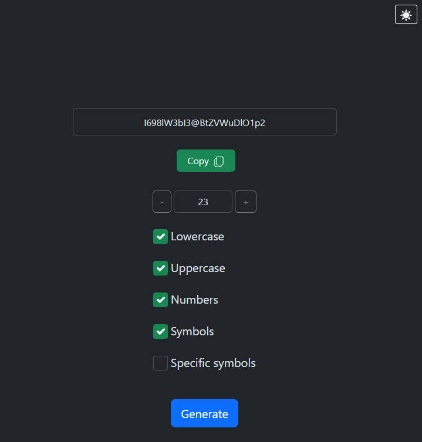

# 🔒 Password Generator

A modern, lightweight password generator web application built with vanilla JavaScript, Bootstrap & vanilla CSS. Generate secure, customizable passwords with an intuitive user interface and dark/light theme support.

 🌐 **Live Demo**: [Password generator](https://alex.alwaysdata.net/passgen)

## Screenshot



## Features

### 🔐 Password Generation
- **Customizable Character Sets**: Choose to include or exclude:
  - Lowercase letters (a-z)
  - Uppercase letters (A-Z)
  - Numbers (0-9)
  - Common symbols (?!@#$%^&*+)
  - Special symbols (/()[],.:;=-_)
- **Adjustable Length**: Set password length from 1 to 64 characters using +/- buttons or direct input
- **One-Click Generation**: Generate passwords with a single click

### 📋 Copy to Clipboard
- Copy generated passwords to clipboard instantly
- Visual feedback with tooltip confirmation
- Button state changes to show successful copy

### 🌓 Theme Support
- **Dark/Light Mode Toggle**: Switch between dark and light themes
- **System Preference Detection**: Automatically detects and applies system theme preference on first load
- Theme preference persists across sessions

### 🎨 User Interface
- **Responsive Design**: Works seamlessly on desktop and mobile devices
- **Bootstrap Framework**: Built on Bootstrap 5 for modern, clean design
- **SVG Icons**: Scalable icons for copy, sun, and moon elements
- **Accessibility**: Semantic HTML and proper form controls

## Project Structure

```
Password_Generator/
├── index.html              # Main application page
├── password.html           # Flask template for deployment
├── README.md              # This file
├── css/
│   ├── bootstrap.min.css  # Bootstrap framework
│   └── style.css          # Custom styling
├── js/
│   ├── main.js            # Application entry point and initialization
│   ├── generator.js       # Password generation logic
│   ├── copy.js            # Copy to clipboard functionality
│   ├── length.js          # Password length controls
│   ├── theme.js           # Theme management
│   └── bootstrap.bundle.min.js # Bootstrap JavaScript
└── static/
    └── icons/             # SVG icon files (moon.svg, sun.svg, copy.svg)
```

## Technologies Used

- **HTML5**: Semantic markup and form structure
- **CSS3**: Responsive styling with media queries
- **JavaScript (ES6+)**: Modular JavaScript with imports/exports
- **Bootstrap 5**: Responsive grid and component styling
- **SVG**: Scalable vector graphics for icons

## How to Use

1. **Open the Application**: Open `index.html` in any modern web browser
2. **Configure Password Options**:
   - Check/uncheck character type options (Lowercase, Uppercase, Numbers, Symbols)
   - Adjust password length using the +/- buttons or by entering a number directly
3. **Generate Password**: Click the "Generate" button to create a new password
4. **Copy Password**: Click the "Copy" button to copy the password to your clipboard
5. **Toggle Theme**: Click the moon/sun icon in the top-right corner to switch themes

## Installation

No installation required! Simply clone or download the repository and open `index.html` in your browser.

For deployment with Flask, use the `password.html` template file.

## Browser Compatibility

Works on all modern browsers supporting:
- ES6 Module imports
- CSS Grid and Flexbox
- Clipboard API
- prefers-color-scheme media query

## Code Architecture

### Module Structure
- **main.js**: Orchestrates the application initialization and module imports
- **generator.js**: Core password generation algorithm with character set management
- **copy.js**: Handles clipboard operations and UI feedback
- **length.js**: Manages password length input validation and constraints
- **theme.js**: Manages theme switching and system preference detection

### Key Features in Code
- **Modular Design**: Each feature is separated into its own module
- **Event-Driven**: DOM events trigger password generation and user actions
- **SVG Icon Loading**: Dynamic SVG loading for scalability
- **Bootstrap Integration**: Tooltips and responsive components

## Customization

### Modify Character Sets
Edit `js/generator.js` to change available characters:
```javascript
const symbols = "?!@#$%^&*+"; // Modify this
const spec_symbols = "/()[],.:;=-_"; // Or this
```

### Adjust Length Constraints
Edit `js/length.js` to change min/max password length (currently 1-64):
```javascript
if (length.value < 64) // Change 64 to desired max
if (length.value > 1)  // Change 1 to desired min
```

### Styling
Modify `css/style.css` to customize colors, spacing, and layout.

## License

Open source project. Feel free to use and modify as needed.

## Notes

- Generated passwords are created locally in your browser—no data is sent to servers
- The application loads SVG icons from `/static/icons/` directory
- Passwords are generated using `Math.random()` for immediate use; for cryptographic applications, consider using `crypto.getRandomValues()`
